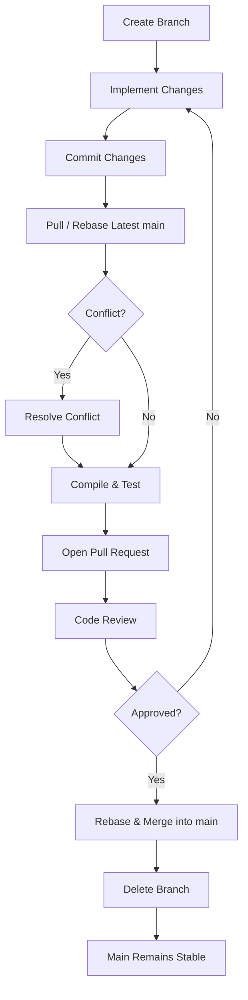

# Git Workflow Plan — Team Effection

## 1. Selected Git Workflow and Rationale

### Selected Workflow: Trunk-Based Development

Our team will use **Trunk-Based Development (TBD)** with short-lived feature branches and Pull Requests (PRs).

The `main` branch is the only long-lived branch. Team members create short-lived branches for individual tasks, complete their work, and integrate it into `main` through a PR.

### Why We Chose This Workflow

This workflow is suitable for our Visual Effects (VFX) project because:

* Our team has multiple members working on the same VFX system.
* Several files may be shared with other teams, so frequent integration helps reduce merge conflicts.
* Small and frequent changes make problems easier to identify and fix.
* Other teams can access completed VFX features without waiting for a long development cycle.
* PRs provide a review process before changes are added to `main`.

Our goal is to keep `main` stable and playable while integrating completed work regularly.

---

## 2. Branch Strategy

We will use the following branches naming convention:

| Branch                  | Purpose                                                     |
| ----------------------- | ----------------------------------------------------------- |
| `main`                  | Main integration branch containing stable and playable code |
| `feature/<description>` | New VFX features or improvements                            |
| `fix/<description>`     | Bug fixes                                                   |
| `docs/<description>`    | Documentation changes                                       |

### Branch Rules

1. Create a branch from the latest `main`.
2. Each branch should focus on **one task or feature**.
3. Keep branches short-lived and merge them as soon as the task is completed and reviewed.
4. Do not create long-lived personal or phase branches.
5. After a branch is successfully merged, delete it.
6. Keep `main` stable and playable at all times.

### Examples

```text
feature/enemy-explosion
feature/player-bullet-trail
fix/particle-leak
docs/vfx-events
```

---

## 3. Commit Rules

### Commit Guidelines

Each commit should contain **one logical change**.

A commit should:

* Be related to the current task.
* Compile successfully whenever possible.
* Not contain unrelated changes.
* Not include debug code, temporary files, or generated files.
* Keep the game playable whenever possible.
* Avoid mixing multiple features, bug fixes, or documentation changes in one commit.

### Commit Message Format

We will use the following format:

```text
<type>(<scope>): <short description>
```

Common types:

| Type       | Usage                   |
| ---------- | ----------------------- |
| `feat`     | New feature             |
| `fix`      | Bug fix                 |
| `docs`     | Documentation           |
| `refactor` | Code restructuring      |
| `perf`     | Performance improvement |
| `chore`    | Maintenance             |
| `revert`   | Revert previous commit  |

**Scope** shows which part of the project the commit affects.
It is written in lowercase inside parentheses, right after the type.

| Scope       | Area                              |
| ----------- | --------------------------------- |
| `particles` | Particle system and particle pool |
| `explosion` | Explosion effects                 |
| `trail`     | Bullet and movement trails        |
| `events`    | VFX event system                  |

Example: `feat(explosion): add enemy explosion effect`
means a new feature was added to the explosion effects.

### Examples

```text
feat(explosion): add enemy explosion effect
fix(particles): fix particle cleanup
docs(events): update effect event documentation
perf(trail): reduce bullet trail particles
```

Commit messages should be short, clear, and describe **what was changed**.

Before commiting, developers should check their changes with : 

* git status 
* git diff
---

## 4. Pull Request and Code Review Rules

### Pull Requests

A PR should be opened when the task is implemented and ready for review.

Before opening a PR, the developer must:

1. Pull/rebase the latest `main` resolve the conflicts locally.
2. Compile the project.
3. Run the game and test all the new changes.
4. Verify that existing functionality is not broken.
5. Clearly describe the changes and how they were tested.

### Code Review

* Approval Requirement: Every functional PR must receive **at least one approval** from another team member.
* Self-approval: The author cannot approve their own PR.
* Shared files: Changes to important shared files should receive a second review when necessary.
* Review Criteria: Reviewers should check
  * Correctness
  * Readability
  * Potential merge conflicts
  * Fulfillment task requirements are satisfied.
* Resolving Feedback: Requested changes must be completed before merging.

### Direct Push to `main`

**Direct pushes to `main` are not allowed for normal development.**

All feature and bug-fix changes must go through a PR and code review.

Only urgent administrative actions, such as restoring a broken `main`, may be handled directly by the responsible team member.

---

## 5. Merge Strategy

### Strategy

Our team uses two main approaches depending on the type of work:
* Feature and Bug-Fix Branches:
   Merged using **Rebase and Fast-Forward** to keep our code history linear and clear.
* Documentation Branches: 
   Merged using **Squash** to combine small text edits and typo fixes into a single clean commit.

Before merging, the branch must be updated with the latest Effection main by rebasing onto it.
After the PR is approved and all tests pass, the changes are integrated into main using a fast-forward merge.


```text
            latest Effection main
                       │
                       ▼
feature/vfx-effect ── rebase ──► feature/vfx-effect
                                      │
                                      │ PR + review
                                      ▼
                                Effection main
                                      │
                                fast-forward
                                      │
                                      ▼
                             updated Effection main
```

### Why Rebase and Fast-Forward?

* Keeps the history simple and linear.
* Makes individual changes easier to understand in git history tools.
* Eliminates clutter from repetitive merge commits.
* Makes it easier to identify and revert problematic changes.

### Merge Commit

Since our team chose Trunk-Based Development (TBD), we aim to integrate small and completed changes into team main frequently while keeping branches short-lived. Therefore, merge commits will not be used for normal feature and bug-fix integration.

Instead, a merge commit may be used when synchronising our team repository with the main class repository (upstream/main) when necessary.

### Conflict Resolution

If a conflict occurs:

1. **Local Rebase First:** 
      The branch author must pull the latest `main` and resolve any conflicts on their local computer before opening a Pull Request.
2. **Consult File Owners:** 
      If a conflict happens in a core shared file, consult the team member responsible for that file before finishing the merge.
3. **Protect Game Assets:** 
      For graphic files, sprite lists, and resource settings, **do not delete a teammate's changes**. Combine both versions so game visuals do not break.
4. **Re-Test Immediately:** 
      After resolving conflicts, always compile and launch the game locally to confirm that gameplay and visual effects still work correctly.
5. **Ask for Help if Stuck:** 
      If a conflict involves another team's work or cannot be resolved easily, discuss it in the team channel or consult the instructor.

---

## 6. Overall Development Workflow

The overall development workflow defines the end-to-end process of a feature, bug fix, or documentation update. To maintain a clean linear history and ensure the `main` branch remains stable and playable at all times, our team follows a structured workflow to ensure that changes are developed and integrated in a controlled manner.  Each task is developed on a separate short-lived branch, kept up to date with `main`, and tested before being submitted for review. Once approved, changes are merged into `main` using our agreed merge strategy, helping the team maintain a stable project throughout development.

The diagram below illustrates the visual overview of this process:



### Step-by-Step Process

1. **Create a branch**

      Create a short-lived branch from the latest `main` branch. Use the appropriate branch naming convention such as `feature/<description>`, `fix/<description>`, or `docs/<description>`.

2. **Implement Changes**

      Develop the assigned feature, fix, or documentation change on the branch. Keep the changes focused on one task.

3. **Commit Changes**

      Commit completed logical changes using clear and consistent commit messages following the agreed format:

   `type(scope): short description`

4. **Pull / Rebase Latest main**
   
      Before opening a Pull Request, update the branch with the latest changes from `main` using rebase to reduce possible conflicts.

5. **Check for Conflict**
   
      If a conflict occurs during the rebase, the branch author resolves the conflict and reviews the affected code before continuing. If there is no conflict, continue to testing.

6. **Compile & Test**
      
      Compile the project and run the game to verify that the changes work correctly and do not break existing functionality.

7. **Open a Pull Request**
   
      Open a Pull Request from the working branch to `main`. The PR should describe the changes made and the testing performed.

8. **Code Review**
   
      Another team member reviews the PR and requests changes if necessary.

9. **Check Approval**
   
      If changes are requested, update the branch and push the changes to the PR. If the PR is approved, proceed with the merge.

10. **Rebase & Merge into main**
   
      Once approved, integrate the branch into `main` using the agreed rebase and fast-forward merge strategy.

11. **Delete Branch**
   
      After the changes have been successfully merged, delete the completed branch to keep the repository clean.

12. **Main Remains Stable**
   
      Following successful branch deletion, `main` is left in a stable, production-ready state. All developers pull the latest `main` to ensure their next feature branch starts from a verified baseline.
      

---

