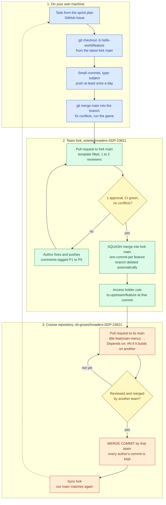

# Git Workflow Plan — Team Hello World (Main Menu)

CSE2024 Software Development Practices, 2026-2, Section 23621, Team 9.
Members: Byeongjoo Hwang, Junwoo Kang, Yongtae Kim, Jaeone Park, Taehyun Bak, Myeongho Song, Changyong Woo, Hyeokjun Lee, Junhyeok Han.

This is the workflow we have been using since 15 September, and it is already version two. Every rule below has been used on real pull requests. The numbers point to them on our fork `eoieiie/Invaders-SDP-23621` or on the course repository `oh-gnues/Invaders-SDP-23621`.

This document is not final. We change it when something in practice shows a rule is wrong. We made seven rule decisions in the first week alone, and section 7 lists each one with the pull request or thread behind it. Section 8 lists what we left open on purpose and what will make us revisit it. Anyone on the team can propose a change in our Slack channel, we decide it at the Tuesday sprint planning, and the file is edited the same day.

## 1. Selected Git Workflow and Rationale

Between teams we use the **Forking Workflow**. Nine teams share one course repository, and nobody except one member per team can push to it. Each team keeps its own copy of the repository, works there, and sends finished work back as a pull request.

Inside our fork we use **GitHub Flow**: one long-lived branch, `main`, and short feature branches that live one or two days and come back through a pull request.

Put together it is two layers. A feature branch merges into our fork's `main` after a team review, and our fork's `main` goes to the course repository one feature at a time.

We chose it for these reasons:

| Question | Our situation | What we decided |
|---|---|---|
| Who can write to the project? | Nine teams share one repository, and each team has only one member with write access. | Work in a fork. All nine of us can push there, so nobody waits on one person to get started. |
| How fast do changes need to integrate? | Most of us had never opened a pull request before this course, and our features are small. A screen shell is around 60 lines, and the settings screen, which has the most in it, is about 120. | Branches live one or two days, one or two people review each pull request, and a CI job compiles every pull request. |
| How does the project release? | There is no version to release. The game in the course repository is the product and it changes whenever a team merges. | Release from the development line. No release branches. |
| Which versions need maintenance? | Only the current one. Nothing older is kept. | No maintenance branches. A fix is just another pull request. |
| Who owns integration? | Every other team's screen is opened from our main menu, so a mistake here shows up everywhere. | Two reviewers inside the team. One access holder opens every pull request to the course repository and keeps the fork in sync, but another team merges it. |

What we did not choose:

| Alternative | Why not |
|---|---|
| Centralized workflow, everyone commits to one `main` | Nine teams committing straight to a shared repository means every mistake is in front of every team within the hour. It also does not match the access we have, since only one person per team can write there. |
| Full Git Flow with `develop` and release branches | A `develop` branch means one more merge for every change, and it would not catch anything our fork's `main` does not already catch. Release branches solve a versioning problem we do not have. |
| Feature branches sent straight to the course repository | Our half-finished work would sit in a list that eight other teams read, and a review between two of our own members would be something they have to scroll past. |

What each choice costs us, and what we do about it:

| Choice | Good | Bad | What we do about it |
|---|---|---|---|
| A fork per team | The team reviews before anything reaches the shared repository, and nine people can push without waiting for permission. | The fork falls behind the course repository between syncs, so conflicts with other teams appear late. | The access holder syncs after every merge, and the author merges `main` into the branch right before opening a pull request. |
| Short branches, no `develop` | A branch lives a day or two, so conflicts stay small and one merge is one feature. | There is no staging area. Whatever reaches our `main` is what goes upstream. | Branch protection, one required approval and a compile check are the staging area. |
| Squash inside the fork, merge commit upstream | One commit per feature in the fork, and each author's commit survives upstream. | Two merge methods to remember. | Only the access holder merges upstream, so only one person needs to remember the second one. |

On top of this we run one-week sprints: plan on Tuesday, a three-line update on Slack each day, review on Friday.

## 2. Branch Strategy

| Branch | Where | What it is for | Created | Merged into | Deleted |
|---|---|---|---|---|---|
| `main` | course repository | The game. Nine teams' finished work | already exists | — | never |
| `main` | our fork | The course repository plus our finished, reviewed work | already exists | course repository `main` | never |
| `hello-world/<feature>` | our fork | One feature by one person | when the task starts, from the latest fork `main` | fork `main` | right after the merge, automatically |
| `to-upstream/<feature>` | our fork | A snapshot of one feature, used only as the source of an upstream pull request | by the access holder, at that feature's squash commit | course repository `main` | by hand, once that pull request is merged |

Rules:

- Branch names are `hello-world/` plus a short feature name, like `hello-world/menu-framework` or `hello-world/shop-shell`.
- Cut the branch from the latest fork `main`. Before opening the pull request, merge `main` into the branch again so there are no conflicts.
- Never open an upstream pull request from fork `main` directly. `main` keeps moving, so anything merged afterwards would quietly be added to the open pull request. The access holder cuts a `to-upstream/<feature>` branch at that feature's commit and opens the pull request from there. We learned this on upstream #22, which we closed and reopened as #23.
- No `develop` branch and no release branches.

## 3. Commit Rules

One commit is one change that stands on its own and compiles: a method added, a screen class created, a rename. Not a whole day of work in one commit, and not two unrelated fixes together.

The message is `type: what you did`, in English, and the first line stays under 50 characters.

| Type | When |
|---|---|
| `feat` | new behaviour |
| `fix` | bug fix |
| `refactor` | no behaviour change |
| `docs` | documentation only |
| `test` | tests |
| `ci` | CI and workflow files |
| `chore` | build, config, ignore files |
| `style` | formatting only |

From our own history: `feat: add menu framework for the title screen` (#6), `fix: polish title menu from #6 review` (#7), `chore: ignore IDE and build output directories` (#5).

A commit template is in the repository as `.gitmessage.txt`, and each member runs `git config commit.template .gitmessage.txt` once. The author of a commit is the person whose name is on it.

Because we squash, the pull request title becomes the commit that lands on `main`, so it follows the same format: `type: subject`, imperative, no full stop, under 50 characters. One of ours went over before we noticed, #12 at 61 characters.

Pull requests to the course repository add our scope, `feat(main-menu): ...`, so the other eight teams can tell at a glance which team a pull request comes from.

## 4. Pull Request and Code Review Rules

**When to open one.** As soon as the feature works from start to finish at its smallest useful size, for example the menu item opens the screen and ESC comes back. Not when it is polished, since that is what the review is for. One feature per pull request, and under about 400 changed lines. If it touches a file every team uses, `Core`, `DrawManager` or `GameScreen`, say so in the description.

**Description.** The template is in the repository at `.github/pull_request_template.md` and appears on its own: What, Why, Changes, How to test with steps a reviewer can actually press, Screenshots for anything visible on screen, and a checklist. Sections that do not apply can be deleted, but the checklist stays.

**Reviewers.** The author asks one or two people, not the whole team. One reads the code, one runs the How to test steps on their own machine. Who does which is decided per pull request, whoever is free.

**Review comments** start with a priority tag so the author knows what has to happen.

| Tag | Meaning | What the author does |
|---|---|---|
| P1 | breaks behaviour or a rule | must fix, reviewer requests changes |
| P2 | should be fixed before merge | must fix |
| P3 | should be fixed, can be a follow-up | author decides, and says which |
| P4 | suggestion | optional |
| P5 | small thing | optional |

**To merge into our fork's `main`:** at least one approving review, CI green, and no conflicts with `main`. Branch protection enforces the review and blocks force-push, so pushing straight to `main` is not possible.

**To merge into the course repository:** another team's access holder reviews it and merges it. Nobody on our team merges our own work there, including our access holder. Our side of it is opening the pull request, posting the link in the leaders' channel, and answering whatever the reviewer asks. Self-merge by the author was allowed by the instructor on the first day only. The one standing exception is our team README: a README change can be merged by our access holder without waiting for another team, which is what happened with upstream #59. Everything else, code and documents alike, waits for another team.

**Pushing directly to `main`** is not allowed in either repository, for anyone, the team leader included. Every change goes through a pull request.

## 5. Merge Strategy

| Where | Method | Why |
|---|---|---|
| feature branch into fork `main` | **Squash and merge** | One feature becomes one commit under the author's name. The history reads as a list of features, and one revert undoes one whole feature. Nobody has to keep their work-in-progress commits tidy. |
| `to-upstream/<feature>` into the course repository | **Merge commit**, never squash | An upstream pull request can carry commits from several people. Squashing would turn them into one commit under whoever opened the pull request, and everyone else's work would disappear from the history. |
| keeping a branch up to date | **Merge `main` into the branch**, not rebase | Rebase rewrites commits that are already pushed and needs force-push. It is blocked on `main`, and we avoid it on feature branches too because someone else's local copy breaks when history moves under them. Merging is safer for people who are new to git, and the squash at the end cleans up the extra merge commits anyway. |

**Conflicts.** The author of the branch resolves them, on their own machine: merge the latest `main` into the branch, fix the marked lines, compile, run the game, push. Reviewers do not review a pull request that has conflicts. Our most common one is two people adding a `case` to the same `switch` in `Core.java`. It happened first between #8 and #9, then again between #8 and #11, and the rule is to keep both, in numeric order. For a conflict with another team's change, the access holder syncs the fork first, the author resolves it on the fork, and only then does the upstream pull request go up or get updated.

## 6. Overall Development Workflow

1. Take a task from the sprint plan, which lives in GitHub Issues on our fork.
2. `git checkout main && git pull`, then `git checkout -b hello-world/<feature>`.
3. Work in small commits. Push at least once a day.
4. When it works end to end, `git merge main` into the branch, fix anything, run the game.
5. Push and open a pull request against the **fork's** `main`. Fill in the template, ask one or two reviewers.
6. A reviewer runs the test steps and reads the code, with P tags on the comments. The author fixes and pushes. New commits clear the old approvals, so the reviewer approves again.
7. With one approval and green CI, squash and merge. The branch is deleted automatically.
8. The access holder cuts `to-upstream/<feature>` at that squash commit and opens a pull request against the **course repository's** `main`, titled `feat(main-menu): ...`, with `Depends on: #N` on the first line if it builds on an earlier upstream pull request. The team leader posts the link in the leaders' channel.
9. Another team's access holder reviews it and merges it with a merge commit. We do not merge our own work there. Once it is in, our access holder presses Sync fork so our `main` matches the course repository again, and deletes the `to-upstream/<feature>` branch.



Reading it: each block is one layer, and fewer people can write as you go down. All nine of us work in layer 1 and can merge in layer 2 after one approval. Only the access holder opens pull requests in layer 3, and another team merges them. The merge method changes between layers on purpose, squash inside the fork so a feature is one commit, merge commit upstream so each author's commit survives.

The same thing as text, in case the diagram does not render:

```
[1. local]    task -> branch hello-world/<feature> -> small commits -> merge main in, fix, run
                                                                              |
[2. fork]     pull request to fork main <- author fixes <- changes requested  |
                    |                              ^                          |
                    +-> 1 approval + CI green + no conflicts -> SQUASH merge -> to-upstream/<feature>
                                                                              |
[3. upstream] pull request to course repo -> another team reviews and merges -> Sync fork -> back to [1]
```

## 7. What changed in the first week, and why

These rules changed between 15 and 21 September, each one because of something that happened on a real pull request. We expect the list to keep growing, and we go over it at the Tuesday planning meeting.

| Date | Before | After | What happened | Where to see it |
|---|---|---|---|---|
| 9/16 | Squash everywhere | Squash in the fork, merge commit upstream | An upstream pull request turned out to carry several people's commits, so squashing it would have put all of them under one name. | upstream #20, #22 commit list |
| 9/17 | Each screen owner picks their own return code | The framework owner publishes one table of codes before anyone starts | Two people were about to use the same code. | Slack thread, fork #6 |
| 9/18 | Upstream pull request opened from fork `main` | Opened from a frozen `to-upstream/<feature>` branch | While upstream #22 was open, the next merge into our `main` would have been added to it without anyone noticing, which breaks one feature per pull request. | upstream #22 closed, #23 opened |
| 9/18 | A `develop` branch was suggested | Not adopted. Our fork's `main` is the integration branch | The concern was keeping `main` stable. We went through what a third branch would add and it was nothing our fork's `main` did not already do, while costing one more merge on every change. | Slack thread |
| 9/18 | Reviewers catch formatting problems | A style checker on CI should catch them | Two of four screen pull requests needed an extra round for indentation, javadoc and spacing in log messages, which is reviewer time spent on something a tool does better. | fork #8, #9 |
| 9/19 | Each screen sets its own colour before drawing a title | A `drawScreenTitle` helper | One review comment about black text on a black background applied to every screen, so one helper replaced four copies of the same workaround. | fork #9 review, #10 |
| 9/21 | Tasks tracked in Slack messages | Tasks tracked as GitHub Issues | People were asking in chat who was doing what. | fork issues #14 to #20 |

Each rule came from a real failure, was discussed in the thread where it happened, and was written down the same day.

## 8. What we left open

Things we decided not to settle yet, and what will make us come back to them.

| Open question | Why we left it | We revisit it when |
|---|---|---|
| Upstream reviews can take days. Seven of our pull requests sat over a weekend because every reviewer is on another team with its own deadline. | We do not control other teams' time. Asking in person during class is what works now. | If pull requests regularly wait more than two class days, we propose a review rota in the leaders' channel. |
| One person ended up reviewing most of six pull requests that landed in one weekend. | Two reviewers per pull request is enough at the rate we open them. | If more than three are open at once, we add a third regular reviewer. |
| Formatting is still checked by people. | We wanted a week of real pull requests first, to see which rules actually matter before turning a checker on. | Once the style checker runs on CI, the formatting items come off the review checklist. |
| Other teams will edit our screens. The shop, achievements and ship select screens are ours only as far as the door, and the owning teams fill them in. | We have not agreed how those teams hand changes to those files back to us. | At the first pull request from another team that touches one of our screens. |
| Upstream pull requests appear to contain each other until the earlier ones merge. | That is how snapshot branches work, and it is correct, but an outside reviewer can read it as one pull request doing too much. | If a reviewer from another team is confused by it, we add a line to the pull request template explaining it. |
| No tests. | The game has no test setup and no build tool, so a compile check was the cheapest thing that catches something. | When the course covers testing, we add JUnit for `MenuItem` and run it on CI. |

## Other agreements

- Everything on GitHub is in English: commits, pull requests, reviews, wiki.
- Pull request notifications, daily updates and questions go to our Slack channel, which is subscribed to the fork's pull requests, reviews and comments. Casual chat stays in KakaoTalk.
- A bug that is not part of any team's requirement is reported as an Issue on the course repository by whoever finds it, like upstream #21, and fixed by the team that owns the file.
- Copilot review comments are treated like any other reviewer's. Fix what is right locally and commit it yourself, rather than using the Apply suggestion button, which adds a second author to the commit.
- Return codes for new screens come from one table kept by the framework owner, not chosen individually. See fork #6.
- Where our documents live. This plan is in our fork at `teams/HelloWorld-Git-Workflow.md`, next to our requirements document `teams/HelloWorld.md`, so it travels with the code and goes to the course repository with the rest. The wiki at [github.com/eoieiie/Invaders-SDP-23621/wiki](https://github.com/eoieiie/Invaders-SDP-23621/wiki) holds the pages we read while working: Setup for getting the game running, Workflow, Conventions, Sprint, and Meetings for what we decided each week. The wiki is the working copy we edit first, and this file is the version that is reviewed and merged.